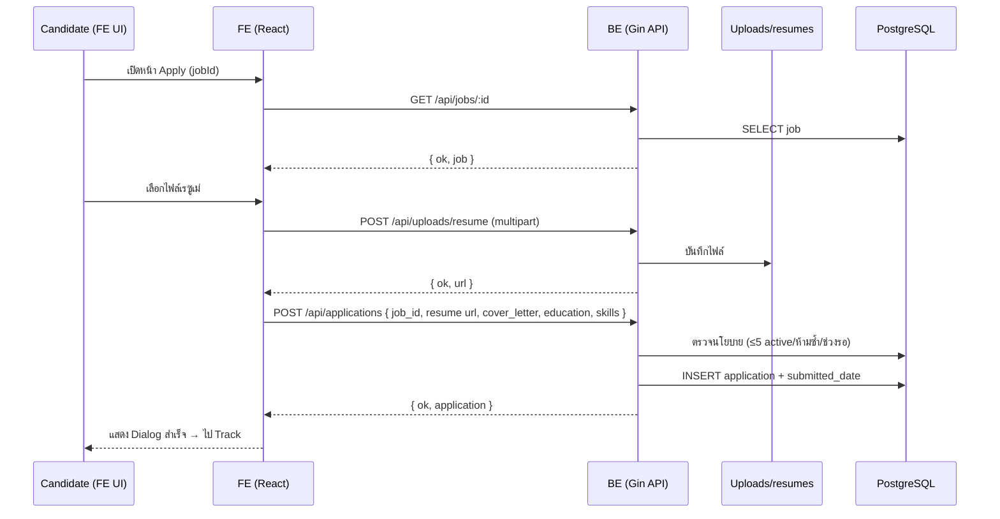
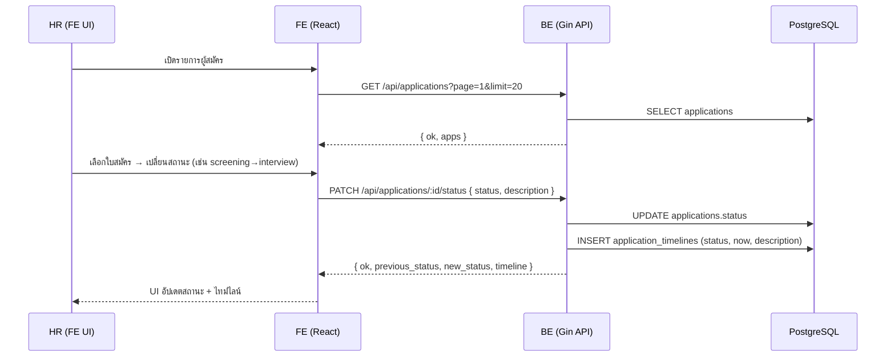
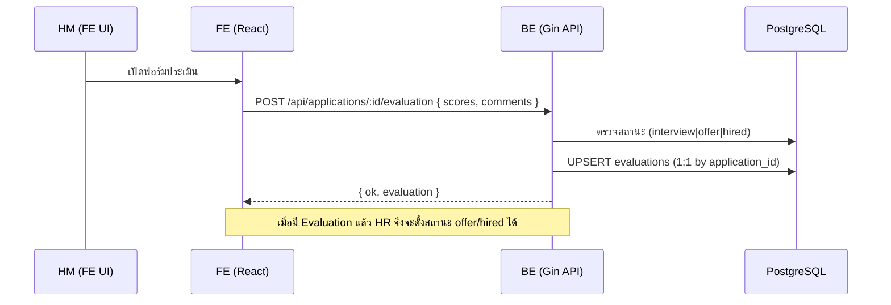
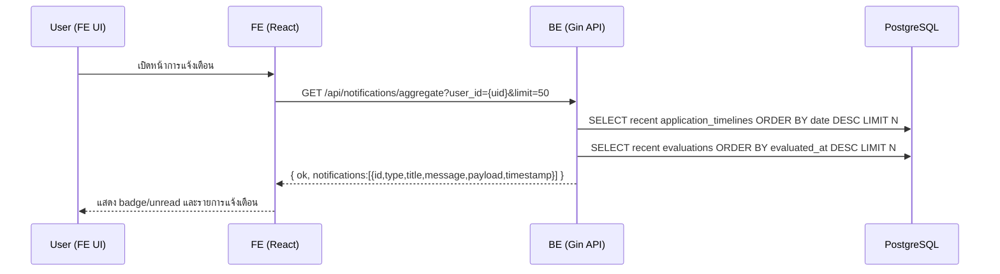
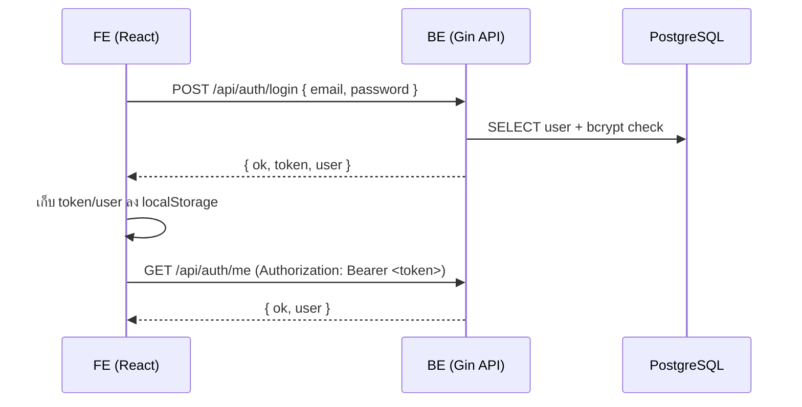

# AATS – แผนภาพสถาปัตยกรรม/ลำดับเหตุการณ์/ความสัมพันธ์ข้อมูล (TH)

อัปเดต: 2025-10-16

หมายเหตุ: ใช้ Mermaid สำหรับวาดไดอะแกรม หากเครื่องมือแสดงผล Markdown ของคุณไม่รองรับ Mermaid ให้ดูเป็นโค้ดหรือเปิดด้วย viewer ที่รองรับ

---

## 1) System Architecture (ภาพรวม FE ↔ BE ↔ DB)
```mermaid
flowchart LR
  U[ผู้ใช้<br/>(Candidate / HR / HM)] --> B[Browser]
  B --> FE[Frontend (React + Vite + Tailwind + shadcn/ui)]
  FE -- Axios + Bearer JWT --> API([VITE_API_URL /api])
  API --> GIN[Backend (Gin Router)<br/>main.go]
  GIN --> MW[Middleware<br/>(CORS / Auth(JWT) / Role)]
  MW --> H[Handlers<br/>(auth, jobs, applications, notes, evaluation, uploads, notifications, dev)]
  H --> M[Models + GORM]
  M --> DB[(PostgreSQL)]
  H --> UP[(uploads/resumes)]
  H --> DEV[(Dev Seed endpoints)<br/>Debug mode only]

  classDef be fill:#1B3C53,stroke:#0f2533,color:#fff
  classDef fe fill:#f2f7fb,stroke:#8bb9da,color:#1b3c53
  class FE fe
  class API,GIN,MW,H,M,DEV be
```

จุดสังเกต
- FE เรียก BE ผ่าน `Axios` ที่กำหนด base URL ใน `fe/.env.local` (ตัวแปร `VITE_API_URL`)
- Bearer JWT แนบอัตโนมัติผ่าน interceptor (`src/services/api.js`)
- BE ตรวจ JWT/CORS ผ่าน middleware และเข้าถึง DB ด้วย GORM
- ไฟล์เรซูเม่ถูกจัดเก็บใน `be_clean/uploads/resumes/` (โปรดักชันควรเสิร์ฟผ่าน static/proxy หรือ Object Storage)

---

## 2) Entity–Relationship (ER) Diagram
```mermaid
erDiagram
  USER ||--o{ JOB_POSTING : creates
  USER ||--o{ APPLICATION : submits
  JOB_POSTING ||--o{ APPLICATION : has
  APPLICATION ||--o{ APPLICATION_TIMELINE : has
  APPLICATION ||--o{ NOTE : has
  APPLICATION ||--|| EVALUATION : has

  USER {
    string ID PK
    string Email UNIQUE
    string Password
    string Role
    string Name
    string Phone
    string Department nullable
    string Position nullable
    time   CreatedAt
    time   UpdatedAt
  }
  JOB_POSTING {
    string ID PK
    string Title
    string Department
    string Location
    string ExperienceLevel
    string Description
    string Requirements JSON-string
    string Responsibilities JSON-string
    string Status
    time   PostedDate
    time   ClosingDate
    string CreatedBy
    time   CreatedAt
    time   UpdatedAt
  }
  APPLICATION {
    string ID PK
    string JobID
    string ApplicantID
    string Resume
    string CoverLetter
    string Education JSON-string
    string Experience JSON-string
    string Skills JSON-string
    string Status
    time   SubmittedDate
    time   CreatedAt
    time   UpdatedAt
  }
  APPLICATION_TIMELINE {
    string ID PK
    string ApplicationID
    string Status
    time   Date
    string Description
    time   CreatedAt
  }
  EVALUATION {
    string ID PK
    string ApplicationID UNIQUE
    string EvaluatorID
    string EvaluatorName
    int    TechnicalSkills
    int    Communication
    int    ProblemSolving
    int    CulturalFit
    float  OverallScore
    string Strengths
    string Weaknesses
    string Comments
    time   EvaluatedAt
  }
  NOTE {
    string ID PK
    string ApplicationID
    string Author
    string CreatedBy
    string Content
    time   CreatedAt
  }
```

---

## 3) Sequence — Candidate Apply Flow


---

## 4) Sequence — HR Update Status (with Timeline)


หมายเหตุ: หากเปลี่ยนเป็น `offer/hired` จะมีการตรวจว่ามี `evaluation` จาก HM แล้วหรือไม่

---

## 5) Sequence — HM Create/Update Evaluation


---

## 6) Sequence — Notifications Aggregate


---

## 7) Sequence — Authentication (Login + Me)


---

## 8) Deployment (Docker Compose + Local Dev)
```mermaid
flowchart TB
  subgraph Host Dev Machine
    FEDEV[FE Dev Server\nVite :5173]
    BE[BE Gin :8080]
    DC[Docker Compose]
  end

  DC --> PG[(Postgres:16\nhost:5433 -> container:5432\nvolume: pgdata)]

  FEDEV -- VITE_API_URL=http://localhost:8080/api --> BE
  BE -- DATABASE_URL=postgres://...:5433/aats_db --> PG

  note right of BE: .env (PORT, JWT_SECRET, DATABASE_URL)
  note left of FEDEV: .env.local (VITE_API_URL)
```

คำแนะนำ
- ตรวจว่า `DATABASE_URL` ชี้ `localhost:5433` ตรงกับ docker-compose
- ปรับ CORS ให้ยอมรับเฉพาะโดเมนจริงเมื่อขึ้นโปรดักชัน

---

อ้างอิงไฟล์ที่เกี่ยวข้อง
- BE Routing: `be_clean/main.go`
- Middleware: `be_clean/middleware/{base,auth,role}.go`
- Handlers: `be_clean/handlers/*.go`
- Models/DB: `be_clean/models/{database,models}.go`
- FE Services: `fe/src/services/{api,authService,jobService,applicationService,notificationService}.js`
- FE Pages: `fe/src/pages/**`

